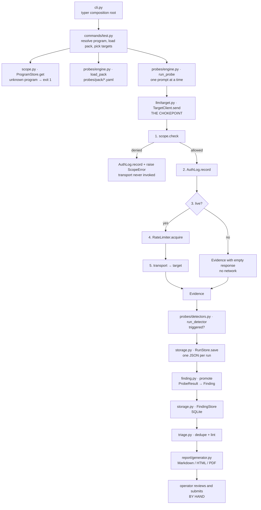

# Architecture

A code map for anyone evaluating promptstrike — what the pieces are, how a probe becomes a report,
and where the safety properties are actually enforced rather than merely claimed.

If you are here to *use* the tool, read the [How-To Guide](how-to-guide.md) instead. If you are here
to run it on your own machine, read the [Administrator Guide](admin-guide.md). This document is for
reading the source.

## What this is, and what it deliberately is not

promptstrike helps a single operator test LLM and agent systems **that have authorized such testing**,
capture reproducible evidence, and write a report good enough to be accepted. It is a CLI tool with
local state. There is no server, no database beyond a local SQLite file, and no multi-user model.

Three things it does not do, by design:

| Not this | Why |
|---|---|
| **Not a scanner** | Scanning is commoditized and the bug-bounty ecosystem actively penalizes autonomous scan-and-spam tooling. The unsolved, higher-value layer is scope enforcement, evidence quality, and report writing. |
| **Never auto-submits** | Every report is produced for the operator to review and submit by hand. Human-in-the-loop is a design invariant, not a missing feature. |
| **Never mass-targets** | Targets come from a hand-registered scope registry, one program at a time, rate-limited. |

Those are constraints on what the code is allowed to become, not just a description of today's
behavior — they are restated in `CLAUDE.md` as gates on future changes.

## The four invariants

These are the properties a reviewer should check, and where each one actually lives. Each is
enforced in code, not by convention, and each is covered by tests.

| # | Invariant | Enforced in | How it fails |
|---|---|---|---|
| 1 | **Authorized programs only.** No traffic to an asset that is not registered in-scope for a program flagged `allows_ai_testing`. | `scope.py` → `check`, `enforce`; called from `llm/target.py` → `TargetClient.send` | Closed. Default-deny: an unmatched target is denied, and out-of-scope beats in-scope. |
| 2 | **Dry run by default.** Nothing leaves the process without an explicit `--live`. | `config.py` → `Settings.dry_run`; `llm/target.py` → `TargetClient.send(live=False)` | Closed. A caller that forgets the flag sends nothing. |
| 3 | **Rate limited (no DoS).** All live target traffic passes a minimum-interval limiter. | `llm/target.py` → `RateLimiter.acquire`, acquired by `TargetClient.send` before every live send | Open if misconfigured — a non-positive rps disables limiting. The rate is set per program or from settings; it is not inferred. |
| 4 | **No auto-submission.** The tool never POSTs a finding to a platform. | Absence of any such code path — nothing anywhere POSTs to a bug-bounty platform. The probe path's only outbound call is `llm/target.py` → `openai_chat_transport`, which talks to the *target*. `FindingStatus` past `ready` is set by the operator, by hand. | N/A — there is nothing to disable. |

Invariant 3 is the one with a real edge: the guard is only as strong as the configured rate. That is
stated in `RateLimiter.acquire`'s docstring rather than hidden, because a reviewer should know which
of these four depends on configuration and which are structural.

## The request path

One probe, end to end. Every arrow is a real call; the numbered steps inside `TargetClient.send` are
the enforcement ordering.



Two things worth noticing in that path:

**Probes never touch the network directly.** `run_probe` calls `client.send()`. It has no transport of
its own and no way to acquire one. That is why a newly added probe inherits scope enforcement,
rate limiting, and authorization logging without its author doing anything — and why the rule
"do not construct a transport in a probe" is the one thing that would break the model.

**A denied attempt is still logged.** `AuthLog.record` runs before the `ScopeError` is raised. The
authorization log's value as a safe-harbor artifact comes from showing what was refused, not only
what was sent. Prompts are recorded as a truncated SHA-256 and a length, never verbatim, so the log
can be handed to a program owner without republishing working exploit text.

## Module reference

### The safety spine

| Module | Responsibility |
|---|---|
| `scope.py` | The scope registry and its decision function. Default-deny precedence: no `allows_ai_testing` → deny; out-of-scope → deny; in-scope → allow; unmatched → deny. `ProgramStore` is YAML-backed, one file per program, so the operator can read and edit scope by hand. |
| `llm/target.py` | `TargetClient` (the chokepoint), `RateLimiter`, `AuthLog`, and the default OpenAI-compatible transport. The transport is injectable, so tests never touch the network. |
| `config.py` | `Settings` from `PROMPTSTRIKE_*` env vars and an env file resolved from **outside the repo**. Holds the `dry_run=True` and `rate_limit_rps` defaults. |

### Probes and evidence

| Module | Responsibility |
|---|---|
| `probes/engine.py` | Loads the declarative pack and runs a probe's prompts through `TargetClient`, collecting `Evidence`. |
| `probes/detectors.py` | The detector registry — `contains_any`, `regex_any`, `refusal_absent`. A detector is `(response, args) -> DetectorVerdict`. Small and declarative on purpose, so new probes rarely need new code. |
| `probes/pack/*.yaml` | The probe library itself. **Data, not code.** |
| `storage.py` | `RunStore` (one JSON file per run — human-inspectable) and `FindingStore` (SQLite, because findings get listed, filtered and updated as they move through their status). |

### Findings and reporting

| Module | Responsibility |
|---|---|
| `models.py` | The pydantic domain contracts shared by every layer: `Program`, `ScopeAsset`, `Probe`, `Evidence`, `ProbeResult`, `Finding`. Validation happens at the boundary. |
| `finding.py` | `promote` — assembles a draft `Finding` from a `ProbeResult`. Deliberately does **not** fabricate impact or remediation; those are the operator's or the drafter's. |
| `cvss.py` | CVSS v3.1 base scoring per the FIRST specification. v4.0 vectors are parsed and validated but **not scored** — the v4.0 base score needs a 270-entry MacroVector table that is error-prone to reproduce, and a subtly wrong score in a submitted report costs more credibility than an absent one. |
| `taxonomy.py` | OWASP Top 10 for LLM Applications (2025) ids, titles, and best-effort CWE defaults. Empty CWE list means "operator supplies it" rather than a guess. |
| `triage.py` | Local-only dedup against your own history, plus a lint against the target platform's checklist. No platform API calls. Aimed at stopping *you* from submitting a duplicate or an incomplete report. |
| `report/generator.py` | Jinja2 rendering to Markdown / HTML / PDF. The WeasyPrint import is lazy, so a missing GTK stack soft-fails to HTML instead of breaking the tool. |
| `report/profiles/` | Per-platform severity vocabulary and required-field checklist. Platforms disagree about what a report must contain, so `Platform` is a behavioral field. |
| `knowledge/` | The vendored offline knowledge pack (OWASP LLM & Agentic, MITRE ATLAS, verification standards). **Vendored, not fetched:** reports must be reproducible, the tool must work offline, and pulling adversarial reference content over the network at test time would be a supply-chain risk in a security tool. |

### Interface

| Module | Responsibility |
|---|---|
| `cli.py` | Thin typer composition root. Subcommand groups attach themselves. |
| `commands/` | One module per command group — `program`, `test`, `finding`, `report`, `triage`, `knowledge`, `tui`. |
| `tui/app.py` | Optional Textual workbench for triage and reporting. The CLI is fully usable without it. |

## Data and trust boundaries

Everything promptstrike writes lives under one directory, `~/.promptstrike/data` by default
(`PROMPTSTRIKE_DATA_DIR` overrides it):

```
data/
  programs/*.yaml       authorized program definitions — the authorization record
  evidence/*.json       probe runs, including prompts and target responses
  reports/              generated reports
  promptstrike.db       findings (SQLite)
  authlog.jsonl         append-only authorization log
```

**None of this is in the repo, and none of it should ever be.** `/data/` is gitignored, anchored to
the repo root — deliberately, because an unanchored `data/` would also swallow
`src/promptstrike/knowledge/data/` and silently drop the vendored knowledge pack from the package.

Treat evidence transcripts as sensitive: they contain working proof-of-concept prompts and real
target responses. Secrets are never read from the repo — the env file resolves from
`PROMPTSTRIKE_ENV_FILE` (an exact file), then `PROMPTSTRIKE_SECRETS_DIR`/.env (a directory you
nominate), then `~/.promptstrike/.env`.

The tool makes outbound connections from exactly two places, and it is worth being precise about
both:

1. **The probe path** — `openai_chat_transport` in `llm/target.py`, to a target endpoint you
   registered. This is the one the four invariants govern.
2. **The optional report drafter** — `llm/draft.py` calls Anthropic's API to draft narrative
   prose for a finding. It is off unless you install the `draft` extra and set an API key, it
   runs long after testing is done, and it is **not** in the probe path or subject to the scope
   check. Note that it sends finding content — including evidence — to a third party, so treat
   enabling it as a disclosure decision.

Nothing else opens a socket. In particular, nothing ever contacts a bug-bounty platform.

## Extension seams

The design intent is that the common extensions are data or a single function, never a new subsystem.

| To add… | Do this | Not this |
|---|---|---|
| A probe | Drop a YAML file in `probes/pack/`. Reference an existing detector by name. | Write Python. |
| A detector | One function `(response: str, args: dict) -> DetectorVerdict`, registered in `_REGISTRY` in `probes/detectors.py`. | Add logic to a probe. |
| A platform | A `Profile` in `report/profiles/` — severity mapping plus checklist — and a `Platform` enum member. | Branch on platform in the generator. |
| A knowledge framework | Add to the vendored pack; `Finding.framework_refs` is a dict keyed by framework precisely so this stays a data change. | Add a field per framework. |

The one thing you must **not** add is a code path that reaches a target without going through
`TargetClient.send`. That method is the single place where all four invariants are enforced together;
routing around it silently removes every one of them.

## Tests

`pytest` from the repo root. 168 tests, no network access required — the transport, the rate
limiter's clock, and its sleep are all injectable, so live behavior is tested deterministically.

`tests/test_scope.py` is the one to read first if you are auditing the safety model: it is where the
default-deny precedence and the boundary-safety of asset matching are pinned down.

## Where to start reading

1. `scope.py` — the safety spine, and the shortest complete idea in the codebase.
2. `llm/target.py` — `TargetClient.send`, where the invariants converge.
3. `probes/engine.py` + `probes/pack/*.yaml` — how a probe is expressed.
4. `models.py` — the vocabulary everything else is written in.
